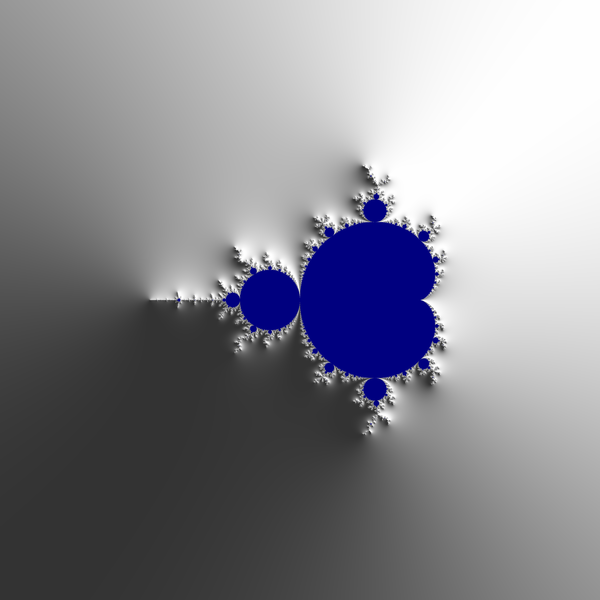
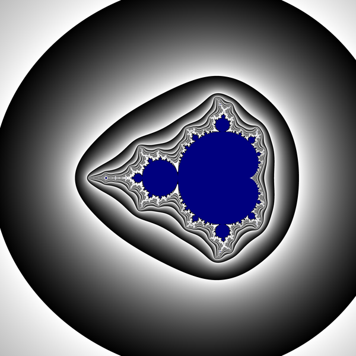
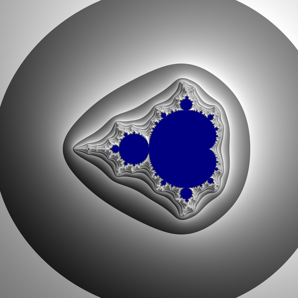

[Blend modes](https://en.wikipedia.org/wiki/Blend_modes)

# example
First image   
  


Second image   

  


3-rd image = Result of blending above images in average mode  

  


# see also
* [KFMovieMaker](https://www.maths.town/after-effects-plugins/kfmoviemaker/kfmoviemaker-download-and-installation)
  * [in wikibooks](https://en.wikibooks.org/wiki/Fractals/kallesfraktaler#KFMovieMaker)
* [color-blend](https://github.com/loilo/color-blend) by Florian Reuschel


# licence
[LICENCE](LICENCE)


# git
```git
git init
git add README.md
git commit -m "first commit"
git branch -M main
git remote add origin git@github.com:adammaj1/Mandelbrot-set-with-blended-gradients.git
git push -u origin main
```
