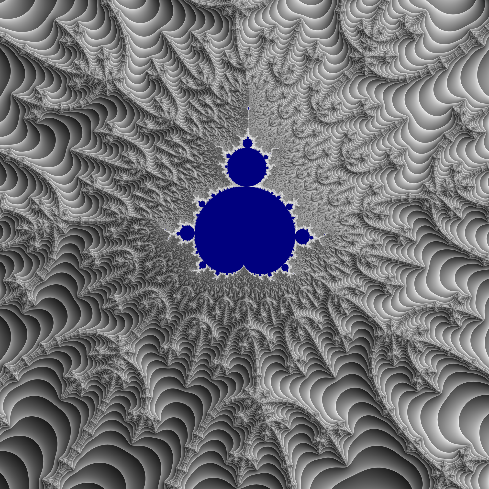
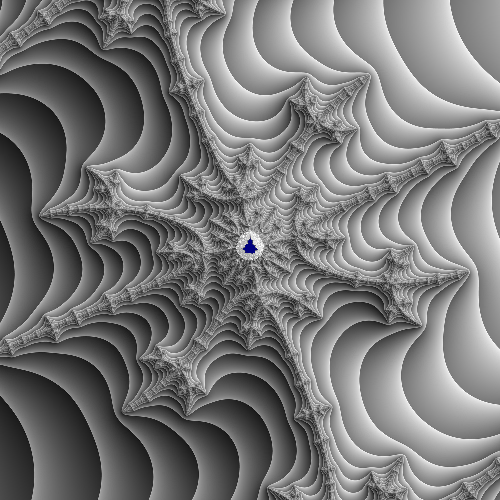
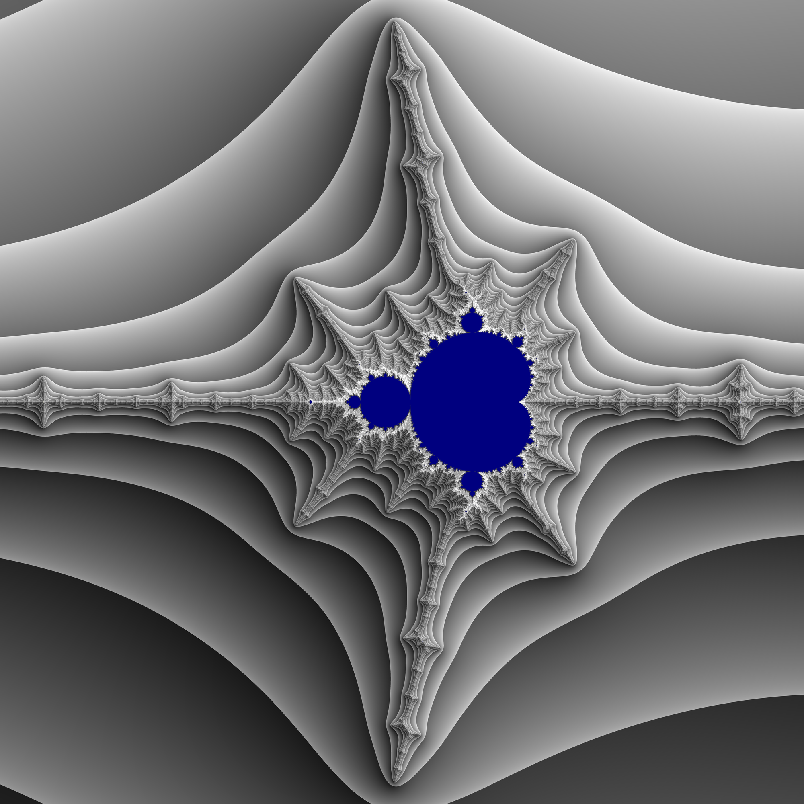
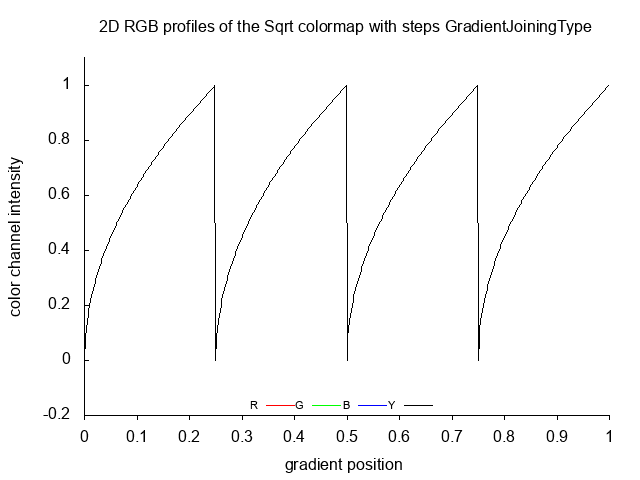
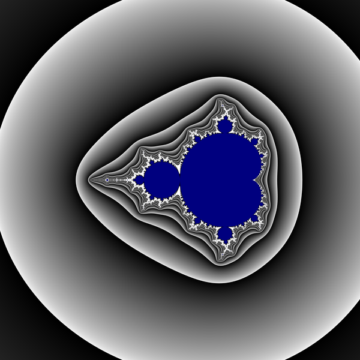
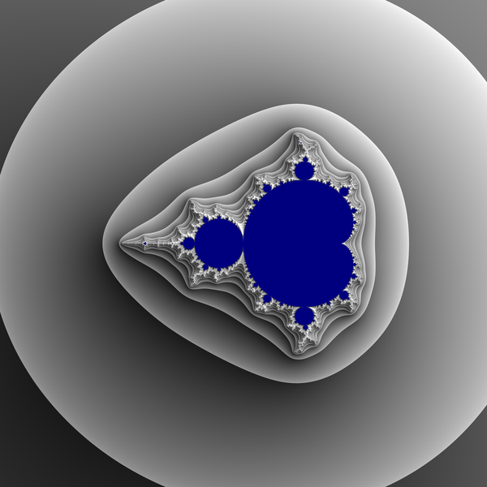

How to use [blend modes](https://en.wikipedia.org/wiki/Blend_modes) to make better images ( of Mandelbrot sets and ...)  
These images are inspired by great technique used by Adam Saka in [KFMovieMaker](https://en.wikibooks.org/wiki/Fractals/kallesfraktaler#KFMovieMaker) and his videos 


#  Results: A picture is worth a thousand words 


  
  
  


# Algorithm 


## Blend modes

Blend types (= modes) definition

```c

typedef enum  {
	no = 0,
	average = 1	
		} BlendType; 
```


How to compute blended color from 2 input colors ? Here color is a single number (shades of gray)  

Basic is [average ](https://stackoverflow.com/questions/726549/algorithm-for-additive-color-mixing-for-rgb-values)

```c
unsigned char GiveBlendedColor( double c1, double c2, BlendType Blend){

	unsigned char t;
	
	switch (Blend){
	
		case average: {t = (c1+c2)/2.0; break;}
		
		
		default: {}
	
	}
	
	return  t;


}

```


There are many blend modes 
* [photoshop](https://stackoverflow.com/questions/5919663/how-does-photoshop-blend-two-images-together)


## potential (Linear step) plus slope

Here exterior of the Mandelbrot set is:
* described by potential
* coloured with 1D gray gradients

Interior is solid colour blue


First image is slope ( normal map = [Lambert reflection (Illumination model or shader )](https://gitlab.com/adammajewski/mandelbrot_wiki_ACh#using-complex-potential-and-lambert-reflection-illumination-model-or-shader-)   
  


Second image: 
* level sets of potential
* [linear step function](https://github.com/adammaj1/1D-RGB-color-gradient#gray-linear-colormap)

")  
    

  


3-rd image = Result of blending above images in average mode  

  


## Potential ( sqrt step ) + slope


First image is the same as above = ( normal map = [Lambert reflection (Illumination model or shader )](https://gitlab.com/adammajewski/mandelbrot_wiki_ACh#using-complex-potential-and-lambert-reflection-illumination-model-or-shader-)


Second image: 
* level sets of potential
* [sqrt step function](https://github.com/adammaj1/1D-RGB-color-gradient#gray-sqrt-colormap). It is inverterd

```c
 p = 1.0 - p;
```


")  
    

  


3-rd image = Result of blending above images in average mode  

  


# see also
* [KFMovieMaker](https://www.maths.town/after-effects-plugins/kfmoviemaker/kfmoviemaker-download-and-installation) by Adam Saka
  * [github repo](https://github.com/adamsaka/KFMovieMaker)
  * [in wikibooks](https://en.wikibooks.org/wiki/Fractals/kallesfraktaler#KFMovieMaker)
* [color-blend](https://github.com/loilo/color-blend) by Florian Reuschel
* Image composition
  * [ImageMagic](https://imagemagick.org/script/composite.php) and [Composite compositions by Alan Gibson.](http://im.snibgo.com/compcomp.htm)
  * [Digital compositing ](https://en.wikipedia.org/wiki/Digital_compositing) and [Alpha compositing](https://en.wikipedia.org/wiki/Alpha_compositing) in wikipedia
* shaded relief
  * [How to calculate shaded relief for the entire world with GDAL, fast image by Anna Thieme](https://blog.datawrapper.de/shaded-relief-with-gdal-python/)  
  * [Hill-Shading the Mandelbrot Set](https://eamonn.org/programming/2021/01/29/mandelbrot-3.html) and [almondbread by  eobrain ( c++)](https://github.com/eobrain/almondbread)

# program
c console program for creating static images (png)

dependencies
* bash
* gcc
* GNU Make
* OpenMP
* Image Magic convert ( from ppm to png )


to run

```
make
```


# licence
[LICENCE](LICENCE)


# git
```git
git init
git add README.md
git commit -m "first commit"
git branch -M main
git remote add origin git@github.com:adammaj1/Mandelbrot-set-with-blended-gradients.git
git push -u origin main
```

local repo:  ~/Mandelbrot-set-with-blended-gradients


## Welcome to GitHub Pages

You can use the [editor on GitHub](https://github.com/adammaj1/Mandelbrot-set-with-blended-gradients/edit/gh-pages/index.md) to maintain and preview the content for your website in Markdown files.

Whenever you commit to this repository, GitHub Pages will run [Jekyll](https://jekyllrb.com/) to rebuild the pages in your site, from the content in your Markdown files.


### Markdown

Markdown is a lightweight and easy-to-use syntax for styling your writing. It includes conventions for

```markdown
Syntax highlighted code block

# Header 1
## Header 2
### Header 3

- Bulleted
- List

1. Numbered
2. List

**Bold** and _Italic_ and `Code` text

[Link](url) and 
```

For more details see [GitHub Flavored Markdown](https://guides.github.com/features/mastering-markdown/).

### Jekyll Themes

Your Pages site will use the layout and styles from the Jekyll theme you have selected in your [repository settings](https://github.com/adammaj1/Mandelbrot-set-with-blended-gradients/settings). The name of this theme is saved in the Jekyll `_config.yml` configuration file.

### Support or Contact

Having trouble with Pages? Check out our [documentation](https://docs.github.com/categories/github-pages-basics/) or [contact support](https://github.com/contact) and we’ll help you sort it out.
